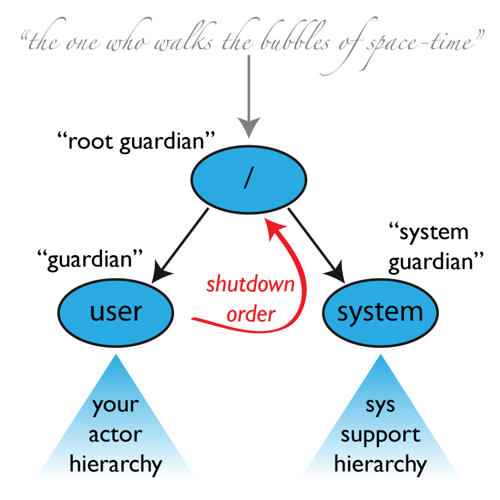

# 监管与监控

这一节将简述监管背后的概念、原语及语义。要了解这些如何转换成真实代码，请参阅相关的Scala和Java API章节。

###监管的意思
在 [Actor 系统](02_actor_systems.md) 中说过，监管描述的是actor之间的依赖关系：监管者将任务委托给下属，并相应地对下属的失败状况进行响应。当一个下属出现了失败（即抛出一个异常），它自己会将自己和自己所有的下属挂起，然后向自己的监管者发送一个提示失败的消息。基于所监管的工作的性质和失败的性质，监管者可以有4种基本选择：

1. 恢复下属，保持下属当前积累的内部状态
1. 重启下属，清除下属的内部状态
1. 永久地停止下属
1. 升级失败（沿监管树向上传递失败），由此失败自己

始终要把一个actor视为整个监管树形体系的一部分是很重要的，这解释了第4种选择存在的意义（因为一个监管者同时也是其上方监管者的下属），并且隐含在前3种选择中：恢复actor会恢复其所有下属，重启一个actor也必须重启其所有下属（不过需要看下面的详述获取更多细节），类似地终止一个actor会终止其所有下属。需要强调`Actor`类的`preRestart`钩子（hook）缺省行为是在重启前终止它的所有下属，但这个钩子可以被重写；对所有子actor的递归重启操作在这个钩子之后执行。

每个监管者都配置了一个函数，它将所有可能的失败原因（即异常）翻译成以上四种选择之一；注意，这个函数并不将失败actor的标识作为输入。我们很快会发现在有些结构中这种方式可能看起来不够灵活，例如会希望对不同的下属应用不同的策略。在这一点上我们一定要理解监管是为了组建一个递归的失败处理结构。如果你试图在某一个层次做太多事情，这个层次会变得复杂并难以理解，因此这时我们推荐的方法是增加一个监管层次。

Akka实现的是一种叫“父监管”的形式。Actor只能被其它的actor创建——顶部的actor由库来提供——每一个被创建的actor都由其父亲所监管。这种限制使得actor的监管结构隐式符合其树形层次，并提倡合理的设计方法。需要强调的是这也保证了actor不会成为孤儿或者拥有在系统外界的监管者（被外界意外捕获）。另外，这形成了对actor应用(或其子树)一种自然又干净的关闭过程。

> 警告

> 监管相关的父-子沟通，使用了特殊的系统消息及其固有的邮箱，从而和用户消息隔离开来。这意味着，监管相关的事件相对于普通的消息没有确定的顺序关系。在一般情况下，用户不能影响正常消息和失败通知的顺序。相关详细信息和示例，请参见讨论：[消息排序](08_message_delivery_reliability.md#message-ordering)。

###顶级监管者

一个actor系统在其创建过程中至少要启动三个actor，如上图所示。有关actor路径及相关信息请参见[Actor路径的顶级作用域](05_actor_references_paths_and_addresses.md#toplevel-paths)。

##### `/user`: 守护Actor

这个名为`"/user"`的守护者，作为所有用户创建actor的父actor，可能是需要打交道最多的。使用`system.actorOf()`创建的actor都是其子actor。这意味着，当该守护者终止时，系统中所有的普通actor都将被关闭。同时也意味着，该守护者的监管策略决定了普通顶级actor是如何被监督的。自Akka 2.1起就可以使用这个设定`akka.actor.guardian-supervisor-strategy`，以一个`SupervisorStrategyConfigurator`的完整类名进行配置。当这个守护者上升一个失败，根守护者的响应是终止该守护者，从而关闭整个actor系统。

#####`/system`: 系统守护者

这个特殊的守护者被引入，是为了实现正确的关闭顺序，即日志（logging）要保持可用直到所有普通actor终止，即使日志本身也是用actor实现的。其实现方法是：系统守护者观察user守护者，并在收到`Terminated`消息初始化其自己的关闭过程。顶级的系统actor被监管的策略是，对收到的除`ActorInitializationException`和`ActorKilledException`之外的所有`Exception`无限地执行重启，这也将终止其所有子actor。所有其他`Throwable`被上升，然后将导致整个actor系统的关闭。

#####`/`: 根守护者

根守护者所谓“顶级”actor的祖父，它监督所有在[Actor路径的顶级作用域](05_actor_references_paths_and_addresses.md#toplevel-paths)中定义的特殊actor，使用发现任何`Exception`就终止子actor的`SupervisorStrategy.stoppingStrategy`策略。其他所有Throwable都会被上升……但是上升给谁？所有的真实actor都有一个监管者，但是根守护者没有父actor，因为它就是整个树结构的根。因此这里使用一个虚拟的`ActorRef`，在发现问题后立即停掉其子actor，并在根守护者完全终止之后（所有子actor递归停止），立即把actor系统的`isTerminated`置为`true`。

###重启的含义
当actor在处理某条消息时失败时，失败的原因可以分成以下三类:

* 对收到的特定消息的系统错误（即程序错误）
* 处理消息时一些外部资源的（临时性）失败
* actor内部状态崩溃了

除非故障能被专门识别，否则所述的第三个原因不能被排除，从而引出内部状态需要被清除的结论。如果监管者确定它的其他子actor或本身不会受到崩溃的影响——例如使用了错误内核模式的能够自我恢复的应用——那么最好只重启这个孩子。具体实现是通过建立底层`Actor`类的新实例，并用新的`ActorRef`更换故障实例；能做到这一点是因为将actor都封装载了特殊的引用中。然后新actor恢复处理其邮箱，这意味着该启动在actor外部是不可见的，显著的异常是在发生失败期间的消息不会被重新处理。

重启过程中所发生事件的精确次序是：

1. actor被挂起（意味着它不会处理正常消息直到被恢复），并递归挂起其所有子actor
1. 调用旧实例的 `preRestart` hook (缺省实现是向所有子actor发送终止请求并调用 `postStop`)
1. 等待所有子actor终止（使用`context.stop()`）直到 `preRestart` 最终结束；这里所有的actor操作都是非阻塞的，最后被杀掉的子actor的终止通知会影响下一步的执行
1. 再次调用原来提供的工厂生成actor的新实例
1. 调用新实例的`postRestart`方法（其默认实现是调用`preStart`方法）
1. 对步骤3中没有被杀死的所有子actor发送重启请求；重启的actor会遵循相同的过程，从步骤2开始
1. 恢复这个actor

###生命周期监控的含义

> 注意

> 生命周期监控在Akka中经常被引作`DeathWatch`

与上面所描述的特殊父子关系相对的，每一个actor都可以监控其他任意actor。由于actor从创建到完全可用和重启都是除了监管者之外都不可见的，所以唯一可用于监视的状态变化是可用到失效的转变。监视因此被用于绑定两个actor，使监控者能对另一个actor的终止做出响应，而相应的，监督者是对失败做出响应。

生命周期监控是通过监管actor收到`Terminated`消息实现的，其默认行为是抛出一个`DeathPactException`。要开始监听`Terminated`消息，需要调用`ActorContext.watch(targetActorRef)`。要停止监听，需要调用`ActorContext.unwatch(targetActorRef)`。一个重要的特性是，消息将不考虑监控请求和目标终止发生的顺序，也就是说，即使在登记的时候目标已经死了，你仍然会得到消息。

如果一个监管者不能简单地重启其子actor，而必须终止它们，这时监控就特别有用，例如在actor初始化时发生错误。在这种情况下，它应该监控这些子actor并重新创建它们，或安排自己在稍后的时间重试。

另一个常见的应用情况是，一个actor需要在没有外部资源时失败，该资源也可能是它的子actor之一。如果第三方通过`system.stop(child)`或发送`PoisonPill`的方式终止子actor，其监管者很可能会受到影响。

###一对一策略 vs. 多对一策略

Akka中有两种类型的监管策略：`OneForOneStrategy` 和`AllForOneStrategy`。两者都配置有从异常类型监管指令间的映射（见[上文](04_supervision_and_monitoring.md#supervision-directives)），并限制了一个孩子被终止之前允许失败的次数。它们之间的区别在于，前者只将所获得的指令应用在发生故障的子actor上，而后者则是应用在所有孩子上。通常情况下，你应该使用`OneForOneStrategy`，这也是默认的策略。

`AllForOneStrategy`适用的情况是，子actor之间有很紧密的依赖，以至于一个actor的失败会影响其他孩子，即他们是不可分开的。由于重启不清除邮箱，所以往往最好是失败时终止孩子并在监管者显式地重建它们（通过观察孩子们的生命周期）；否则你必须确保重启前入队的消息在重启后处理是没有问题的。

通常停止一个孩子（即对失败不再响应）不会自动终止多对一策略中其他的孩子；可以很容易地通过观察它们的生命周期来做到这点：如果`Terminated`的消息不能被监管者处理，它会抛出一个`DeathPactException`，并（这取决于其监管者）将重新启动，默认`preRestart`操作会终止所有的孩子。当然这也可以被显式地处理。

请注意，在多对一监管者下创建一个临时的actor会导致一个问题：临时actor的失败上升会使所有永久actor受到影响。如果这不是所期望的，安装一个中间监管者；这可以很容易地通过为工作者声明大小为1的路由器来完成，请参阅路由[routing-scala](../chapter3/06_routing.md)或[routing-java`](#TODO)。

